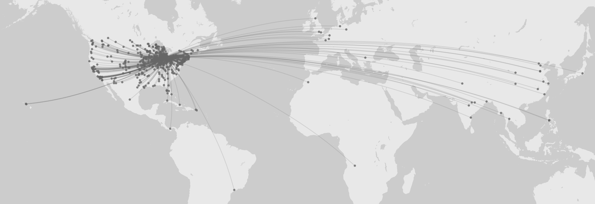

Women's Voices
==============

The Bentley Historical Library (Bentley) publication entitled *Women's Voices: Early Years at the University of Michigan* and associated database were created to showcase the results of a 1924 survey conducted by the Alumni Council of the Alumni Association of the University of Michigan. The survey was sent to approximately 10,250 women who had attended the University from the year 1870, when women were first admitted, to 1924. The survey responses are now part of the University Archives at the Bentley.

You can view the publication online as [HTML](http://quod.lib.umich.edu/w/womv/images/WomensVoices.pdf), as a [PDF](http://quod.lib.umich.edu/w/womv/), or browse or search the [Alumnae Survey Database](http://bentley.umich.edu/legacy-support/um/voices/).

Be aware that we are actively refining our metadata creation and quality control processes and exploring ways to improve the consistenncy and accuracy of our legacy metadata, but in the meantime, you may find some idiosyncracies and curiosities in our data. If you'd like to bring certain issues to our attention, please contact the Bentley's [Division of Reference and Access Services](mailto:bentley.ref@umich.edu).

  * [Survey Responses](README.md#survey-responses)
  * [Attribution](README.md#attribution)
  * [Code Examples](README.md#code-examples)
  * [Pull Requests and Issues](README.md#pull-requests-and-issues)

Survey Responses
----------------

Below are the original survey questions and the metadata fields you'll find in the CSV and JSON files. This dataset, generated from a dump of the original database, is organized by survey response in both JSON and CSV formats (as well as the original XLSX dump). In the CSV file, lists are represented by a single pipe-delimited string, such as "Events -- Commencement|Faculty -- De Pont, Paul R.". The JSON file has a bit more metadata, only because it can accomadate more granular information. No fields in the survey were required, so reponses vary widely in the amount of information they contain. 

Question | Field(s) | Value(s) | Notes
--- | --- | --- | ---
Name in full | first_name, middle_name, married_name | strings | 
Maiden name | last_name | string | 
Address (Business) | address_business (city, state, country) | address_business is a dictionary, city, state and country are strings | 
Address (Business) Coordinates | address_business_latlong |  | Currently only in CSV
Address (Home) | address_home (city, state, country) | address_home is a dictionary, city, state and country are strings | 
Place of birth | place_of_birth (city, state, country) | place_of_birth is a dictionary, city, state and country are strings | 
Race | race | string | 
Single or married |  |  | Not included in database
Present occupation | occupation | string | 
Names, addresses and occupations of children |  |  | Not included in database
Graduate |  |  | Not *explicitly* included in databse
Non-graduate |  |  | Not included in database
Class | degrees (end_year) | degrees is a dictionary, end_year is an integer | 
Check department in which you were registered | departments | list of enumerations (College of Literature, Science, and the Arts, Medical School, Law School, Colleges of Engineering and Architectures, College of Pharmacy, Nurses Training School, College of Dental Surgery, School of Education and Graduate School) | 
Occupations since leaving the University of Michigan | other_occupations | string | 
What church do you attend? |  |  | Not included in database
Public offices held--Social, Civic, Business (City, County, State, National--Elective or Appointive). | public_office | string | 
Achievements in Science, Art, Literature, Journalism, Social Service, etc. | achievement | string | 
What other institutions of higher education have you attended? | degrees (school) | degrees is a dictionary, school is a string
What degrees were conferred upon you? (Including honorary degrees) | degrees (start_year, end_year, degree, school, field, type) | degrees is list of dictionaries, start_year and end_year are integers, degree, school and field are strings and type is an enumeration (undergraduate and graduate) |
What members of your family beside yourself have attended the University of Michigan? | family_attending_um | string | 
War record--dates of service period |  |  | Not included in database
Type of service |  |  | Not included in database
Position held |  |  | Not included in database
Did you serve overseas? |  |  | Not included in database
Citations or decorations |  |  | Not included in database
In your opinion what are the ten most outstanding women who have ever at any time attended the University of Michigan, considered from the standpoint of human service? | influential_women | list of strings | These were turned into a controlled vocabulary.
Do you know of any persons in your Community who are descendants of University of Michigan alumnae or former students? We are particularly anxious to locate all the men whose mothers attended the University. |  |  | Not included in database
How would you characterize the influence of the University of Michigan on your life? |  |  | Not included in database
Won't you add a few of the outstanding memories of your college days? We shall be glad to head of any incident, however trivial, which lingers on your mind. | memories | list of strings | These were turned into Library of Congress Subject Headings. Don't you remember things in Library of Congress Subject Headings?

Example JSON:

```json
{
	"1543": {
		"first_name": "Bell",
		"last_name": "Krolik",
		"middle_name": "",
		"influential_women": ["Barnard, Edith",
		"Effinger, Margaret T.",
		"Hamilton, Alice, 1869-1970",
		"Lehman, Anna Mc",
		"Palmer, Alice Freeman, 1855-1902",
		"",
		"Stearns, Mary T.",
		"Van Hoosen, Bertha, 1863-"],
		"married_name": "Scheyer, David",
		"departments": ["College of Literature, Science, and the Arts"],
		"other_occupation": "",
		"family_attending_um": "",
		"public_office": "",
		"degrees": [{
			"start_year": "1893",
			"degree": "PhB",
			"end_year": "1897",
			"school": "University of Michigan",
			"field": "",
			"type": "undergraduate"
		}],
		"race": "",
		"achievement": "Investigator, United Hebrew Charities, NYC; (Also attended School, Philanthropies of Charity; Organization Societies,; NYC)",
		"occupation": "Housewife"
	}
},
```

Attribution
-----------

Bentley's database records and code provided via this repository are distributed under a [Creative Commons CC0 1.0 Universal Public Domain Dedication ("CCO 1.0 Dedication")](http://creativecommons.org/publicdomain/zero/1.0/). See [license](LICENSE).

Code Examples
-------------

We've included a few example scripts and utilities to help you get started digging into the data made available in this repository.

  * [**top_ten_occupations.py**](code_examples/top_ten_occupations.py) uses the JSON to create a list of all occupations, create a count of each unique occupation and then sort them in reverse order.
  * [**graduate_and_undergraduate_degrees.py**](code_examples/graduate_and_undergraduate_degrees.py) uses the JSON to get a count of degree types (undergraduate or graduate) and percentages, and then uses [matplotlib](http://matplotlib.org/) to do a [very] basic visualization of these percentages.
  * You're code here!
  
It's also easy to create maps like this...



...from the above dataset (this one maps the location of alumnae businesses relative to the University of Michigan). This does not require any code! Simply upload the CSV to a utility like [Palladio](http://palladio.designhumanities.org/).

Pull Requests and Issues
------------------------

Are you doing cool things with our public domain items? Have a script or utility you'd like to share? We welcome your pull requests for code examples that can help others access, reuse, and remix our data and images.

While we appreciate your support in cleaning up our legacy data, we are not able to accept your pull requests to our CSV and JSON datasets. We are actively working to improve our data consistency and completeness, but we do rely on you to help point out factual inaccuracies. If you would like to contribute corrections to our data, please contact Bentley's [Division of Reference and Access Services](mailto:bentley.ref@umich.edu).

If you have suggestions for how we can improve this data documentation, please let us know.
