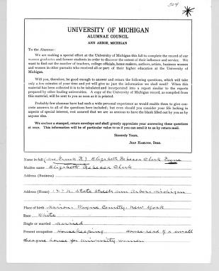

Women's Voices
==============



The Bentley Historical Library (Bentley) publication entitled *Women's Voices: Early Years at the University of Michigan* was created to showcase the results of a 1924 survey conducted by the Alumni Council of the Alumni Association of the University of Michigan. The survey was sent to approximately 10,250 women who had attended the University from the year 1870, when women were first admitted, to 1924. The survey responses are now part of the University Archives at the Bentley.

You can view the publication online as [HTML](http://quod.lib.umich.edu/w/womv/images/WomensVoices.pdf), as a [PDF](http://quod.lib.umich.edu/w/womv/), or browse or search the [Alumnae Survey Database](http://bentley.umich.edu/legacy-support/um/voices/).

This dataset is organized by survey response in both JSON and CSV formats (as well as the original XLSX dump). In the CSV file, lists are represented by a single pipe-delimited string, such as "Events -- Commencement|Faculty -- De Pont, Paul R.". The JSON file has a bit more metadata.

Survey Responses
----------------

Question | Field | Value | Notes
--- | --- | ---
Name in full | 
Maiden name | 
Address (Business) | 
Address (Home) | 
Place of birth | 
Race | 
Single or married | 
Present occupation | 
Names, addresses and occupations of children | 
Graduate 
Non-graduate
Class
Check department in which you were registered
Occupations since leaving the University of Michigan
What church do you attend?
Public offices held--Social, Civic, Business (City, County, State, National--Elective or Appointive).
Achievements in Science, Art, Literature, Journalism, Social Service, etc.
What other institutions of higher education have you attended?
What degrees were conferred upon you? (Including honorary degrees)
What members of your family beside yourself have attended the University of Michigan?
War record--dates of service period
Type of service
Position held
Did you serve overseas?
Citations or decorations
In your opinion what are the ten most outstanding women who have ever at any time attended the University of Michigan, considered from the standpoint of human service?
Do you konw of any persons in your Community who are descendants of University of Michigan alumnae or former students? We are particularly anxious to locate all the men whose mothers attended the University.
How would you characterize the influence of the University of Michigan on your life?
Won't you add a few of the outstanding memories of your college days? We shall be glad to head of any incident, however trivial, which lingers on your mind.


Example JSON:

```json
{
	"690": {
		"first_name": "Leita Margarita",
		"last_name": "Davis",
		"middle_name": "",
		"addresses": [{
			"type": "birth",
			"address": {
				"country": "United States",
				"state": "KS",
				"city": "Elk City"
			}
		},
		{
			"type": "home",
			"address": {
				"country": "United States",
				"state": "KS",
				"city": "Liberty"
			}
		},
		{
			"type": "business",
			"address": {
				"country": "United States",
				"state": "OK",
				"city": "Edmond"
			}
		}],
		"influential_women": ["Palmer, Alice Freeman, 1855-1902",
		"Pomeroy, Katharine P."],
		"married_name": "",
		"departments": ["College of Literature, Science, and the Arts"],
		"other_occupation": "",
		"family_attending_um": "Father: Davis, Dr. J.T.",
		"public_office": "",
		"degrees": [{
			"start_year": "",
			"degree": "",
			"end_year": "",
			"school": "Columbia University",
			"field": "",
			"type": "graduate"
		},
		{
			"start_year": "1907",
			"degree": "AB",
			"end_year": "1911",
			"school": "University of Michigan",
			"field": "Hist.",
			"type": "undergraduate"
		},
		{
			"start_year": "",
			"degree": "MA",
			"end_year": "",
			"school": "University of Pennsylvania",
			"field": "",
			"type": "graduate"
		}],
		"race": "White",
		"memories": ["Faculty -- Dow, Earle W.",
		"Faculty -- Van Tyne, Claude H.",
		"Faculty -- Wenley, Robert Mark",
		"Flora and fauna -- Huron River",
		"Learning -- courses -- History"],
		"achievement": "Teacher; Assoc.Prof. State Teacher's College, History; Social Work",
		"occupation": "Asst.Prof.Hist.College"
	}
}
```
