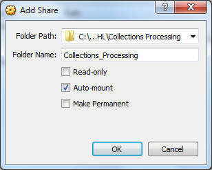

Dependencies:
  * Shared Folders
  * ImageMagick
  * Beautiful Soup
  
Dependencies
============

Shared Folders
--------------

If you wish to move processed materials back to your host machine from the BitCurator VM, you can set up a shared folder that both the host and the VM can write to. In the Shared Folders tab of BitCurator's Settings, click the folder with the green “plus” on it to choose a folder on your host machine to share.sudo

Collection Setup assumes that you've created a shared folder in BitCurator called "sf_Collections_Processing" mapped to C:/BHL/Collections Processing.

ImageMagick
-----------

To install ImageMagick in BitCurator:
  * Open Terminal
  * Type: 
    sudo apt-get install imagemagick

BeautifulSoup
-------------

To install BeautifulSoup in BitCurator:
  * Open Terminal
  * Type:
    sudo apt-get install python-bs4
