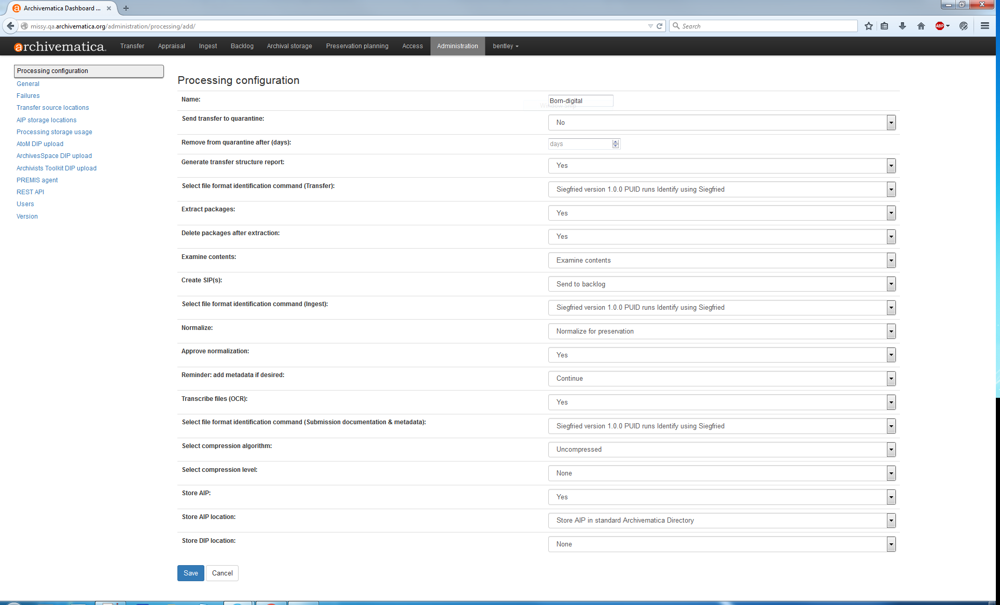

## Administration tab

The Processing Configuration page of the Administration tab provides archivists with an easy form to configure processing defaults for a transfer or SIP. Changing the options using the web interface will write the necessary XML behind the scenes.

Please consult with the Assistant Archivist for Digital Curation before changing any processing defaults---while they should work for the majority of collections, there will undoubtably be exceptions to these rules! See the following explanations for more information:

  * **Send transfer to quarantine** should be checked and set to **No** unless we need to quarantine a transfer to allow for virus definitions to update.
  * **Approve normalization** should be checked and set to **Yes** because we want to process material as efficiently as possible and it is unrealistic to *manually* approve normalization for every file.
  * **Store AIP** should be checked and set to **Yes** so that, again, we're processing material as efficiently as possible, 
  * **Transcribe files (OCR)** should be checked and set to **Yes** due to the enormous potential of Optical Character Recognition (OCR) for improving access to material.
  * **Generate transfer structure report** should be checked and set to **Yes**. [Original order](http://www2.archivists.org/glossary/terms/o/original-order) is a fundamental principle of archives allowing us to preserve existing relationships and evidential significance that can be inferred from the context of the records and exploit the record creator's mechanisms to access the records.
  * **Remove from quarantine after** should not be checked. It is not applicable because we will not be sending digital objects to quarantine.
  * **Create SIP(s)** should be checked and set to **Send to backlog**, as this will allow us make use of the Appraisal tab later.
  * **Extract packages** should be checked and set to **Yes** so that content from zipped or otherwise packaged content will be extracted.
  * **Normalize** should be checked and set to **Normalize for preservation**, which will create preservation copies of the original objects. Note that the original objects are always kept along with their normalized versions.
  * **Reminder: add metadata if desired** should not be checked. This will allow us to enter PREMIS Rights Statements during Ingest.
  * **Examine contents** should be checked and set to **Yes**. This will allow us to check for Personally Identifiable Information (PII), like Social Security numbers and credit card numbers, during the Appraisal step.
  * **Select file format identification command (Transfer)** should be checked and set to **Seigfried version 1.0.0 PUID runs Identify using Siegfried**. Siegfried, while slower, especially for larger files, is sometimes more accurate than FIDO and is better at recognizing contaner formats, such as the Office Open XML format.
  * **Select file format identification command (Ingest)** should be checked and set to **Seigfried version 1.0.0 PUID runs Identify using Siegfried**. See above.
  * **Select file format identification command (Submission documentation & metadata)** should be checked and be set to **Seigfried version 1.0.0 PUID runs Identify using Siegfried**. See above.
  * **Delete packages after extraction** should be checked and set to **Yes**, as we're most interested in preserving what's contained in the packages, not the packages themselves.
  * **Select compression algorithm** should be checked and set to **Uncompressed**. Compression adds a layer of complexity to an AIP, making it harder to preserve, and will only be considered if storage becomes an issue.
  * **Select compressing level** should not be checked. It is not applicable because we will not be compressing AIPs.
  * **Store AIP location** should be checked and set to **aip storage (bhl-archivematica)**. This is managed by MLibrary.
  * **Store DIP location** should not be checked. It is not applicable as we will not be creating DIPs.
  
***

[Digital Processing](digital-processing.md)
  * **Administration**
  * [Appraisal](appraisal.md)
  * [Description and Arrangement](arrangement.md)
  * [Ingest](ingest.md)

