Appraisal and Arrangement
=========================

[Appraisal](http://www2.archivists.org/glossary/terms/a/appraisal), or the process of determining whether records and other materials have permanent (archival) value, is a fundamental archival principle. The Appraisal feature in Archivematica allows archivists to:

  1. review and appraise files in a particular transfer; 
  2. logically arrange digital content with archival description from ArchivesSpace; and
  3. ingest SIPs and deposit AIPs from Archivematica into DSpace, including metadata linked from ArchivesSpace.
  

Preliminaries
-------------

The design of the Appraisal tab is based on the idea of having different "panes" which can be toggled on and off as needed. When the tab is loaded, the **Backlog** and **Analysis** panes are loaded. Clicking on the other pane options (i.e., **File List** or **ArchivesSpace**) will load those panes; any pane can be removed from view by clicking again.

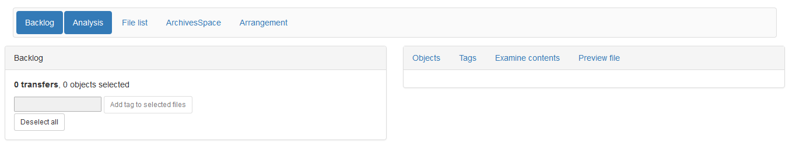

Backlog
-------

Search the backlog by **Accession number** to pull up all transfers associated with a particular accession.

Alternatively, search the backlog using the **Path** option to search by transfer title (part of the path). *Note that Archivematica sanitzes file and folder names as part of it's initial Transfer microservices--any spaces will have been replaced with underscores and this is they way they'll need to be searched.*

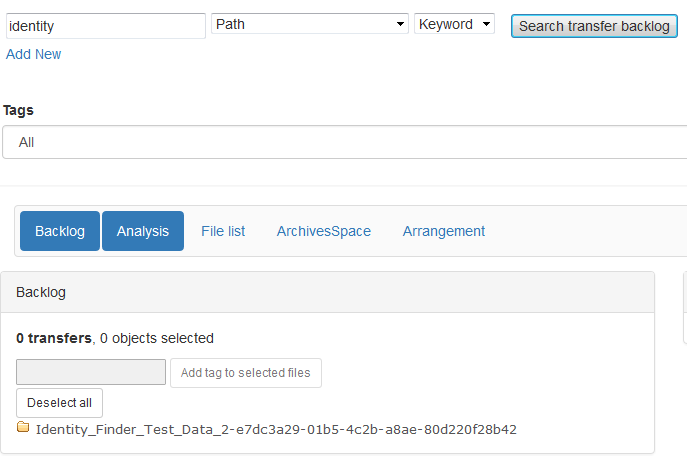

*Note that in the image above, Events_2006 is crossed out because the everything in that transfer has already been ingested.*

To explore a transfer, click on folder icons to expand the contents of that folder. To collapse the contents of a particular folder, click again on the icon. Digital content is located in the "objects" folder. Tags may be applied in the **Backlog** pane---see **Tagging** below.

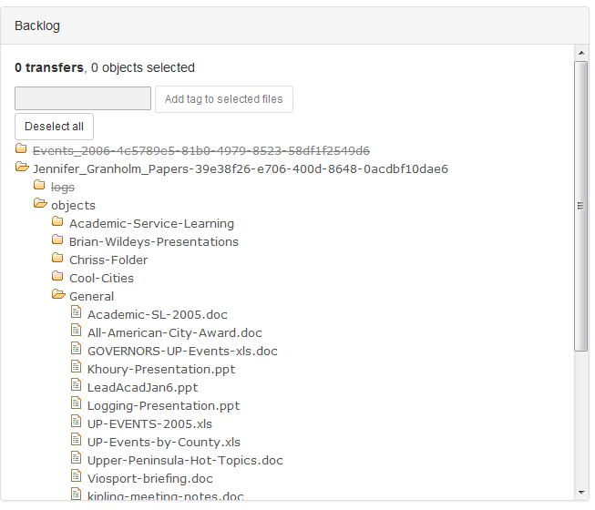

Appraisal
---------

Select one or more folders from the backlog search results by clicking on the folder name to being the appraisal process. You can choose an entire transfer, a folder within a transfer or individual files. Click on the folder name again to deselect that folder, or click **Deselect all** to deselect all.

### Objects

Click on **Objects** in the **Analysis** pane to see a report of file types and sizes and sizes. Click **Report** to see information on file format, PRONOM PUID (clicking on this field will take you to a summary from PRONOM's technical registry), Archivematica FPR Group, number of files and size in tabular form. Columns can be sorted alphanumerically by clicking on the column header.

Click on **Visualizations** to see information on formats by either total number of files or total size of files in a pie chart.

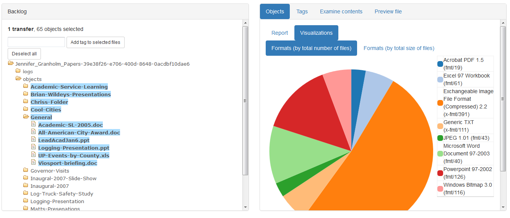

### File list

Ensure that the **File List** pane is toggled on. Clicking on a format type in the **Objects** report or a wedge of the pie chart visualization will populate the **File List** pane with information on files of that format type, including filename, size and last modified date. Use the **Date range start** and **Date range end** fields to limit results by date. Files may be previewed and tags may be applied from the **File List** pane---see [**Preview file**](appraisal.md#preview-file) and [**Tagging**](appraisal.md#tagging) below.

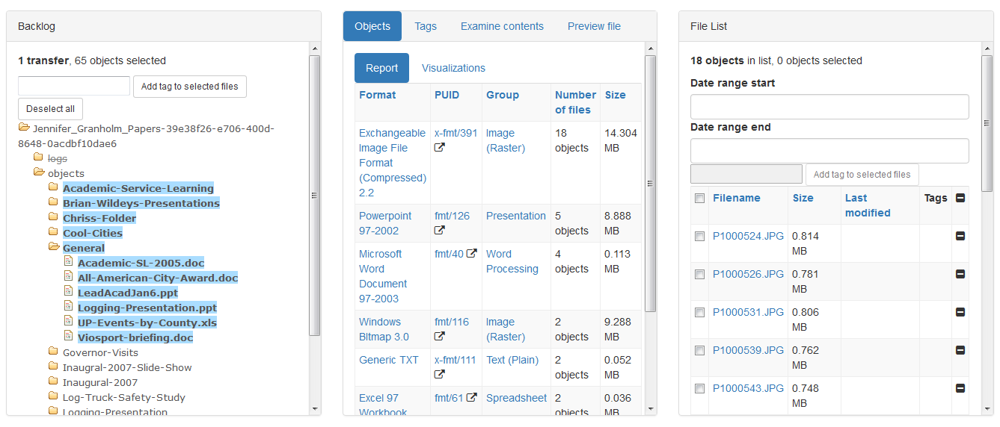

In the image above, Exchangeable Image File Format (Compressed) 2.2 was selected in the **Objects** report in the **Analysis pane**.

### Tags

Click on **Tags** in the **Analysis** pane to see a see a report of tags that have been applied to a particular selection in a transfer and their counts. See [**Tagging**](appraisal.md#tagging) below.

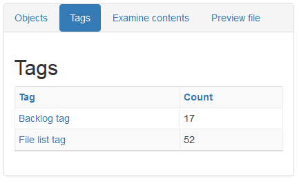

### Examine contents

Click on **Examine Contents** in the **Analysis** pane to see [bulk_extractor](http://forensicswiki.org/wiki/Bulk_extractor) log content for Personably Identifiable Information (PII), including Social Security numbers, as well as credit card numbers. Click on a file name to see a tabular view of content and surrounding context from the bulk_extractor report. Click on **Bulk Extractor logs** to download the logs for local analysis in BEViewer, if necessary. To add files to the **File List** pane, select the ccheckboxes of the files you'd like to populate the **File List** pane and select **Add checked files to filelist**. Alternatively, select every file for popultating the **File List** pane by clicking the chckbox next to the **Filename** column header. Files may be previewed and tags may be applied from the **Examine Contents** pane---see [**Preview file**](appraisal.md#preview-file) and [**Tagging**](appraisal.md#tagging) below.

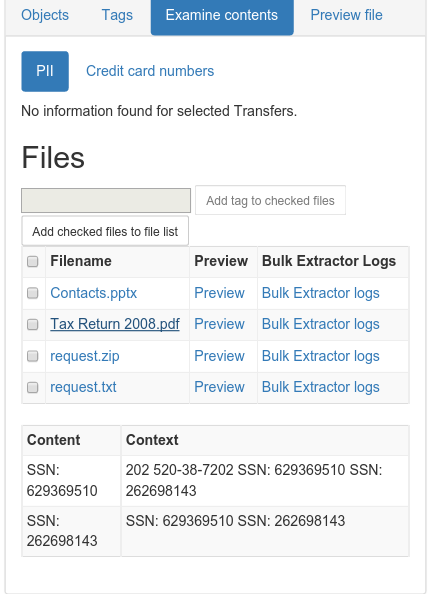

### Preview file

To preview a file in **Preview file** in the **Analysis** pane, click on a filename from the **File List** pane or **Examine contents** in the **Analysis** pane. If your browser has a viewer for the format, it will appear. Alternatively, all files can be downloaded for local analysis:

  * Use **Quick View Plus** to review the content of most files.
  * Use **VLC Media Player** to review the content of audio/video files.
  * Use **IrfanView** to review the content of raster images.
  * Use **Inkscape** to review the content of vector images.
  
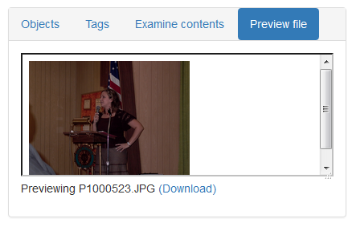

Tagging
-------

Tags can be applied from the **Backlog** pane, the **File List** pane and from **Examine Contents** in the **Analysis** pane. Applying tags allows you to populated the **Backlog** pane with only tagged content of your choosing, particularly in preparation for [Arrangment to ArchivesSpace](arrangement.md). Possible use cases for tags include:

  * Tag everything that you plan to arrang in a specific series or file.
  * Tag sensitive or restricted content as you identify it through analysis.
  * Apply tags as a simple *aide memoire* while processing---it's like a virtual Post-it note.

### From the **Backlog** pane

To apply tags in the **Backlog** pane, select the names of the folders or files you'd like to tag, enter the tag and select **Add tag to selected files**. To remove tags, click the minus sign next to the tag.

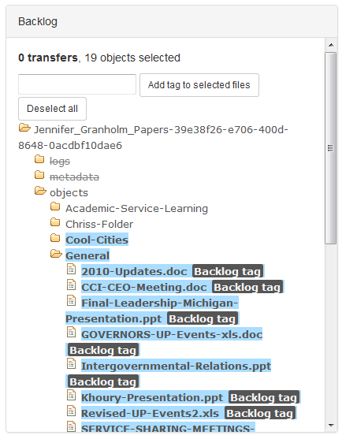

### From the **File List** pane

To apply tags in the **File List** pane, select the checkboxes of the files you'd like to tag, enter the tag and select **Add tag to selected files**. Alternatively, select every file for tagging by clicking the checkbox next to the **Filename** column header. To remove tags, click the minus sign next to the tag.

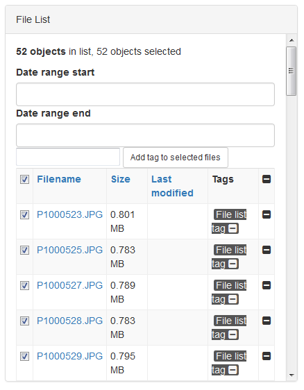

### From **Examine Contents** in the **Analysis** pane

To apply tags in **Examine Contents** in the **Analyis** pane, select the checkboxes of the files you'd like to tag, enter the tag and select **Add tag to selected files**. Alternatively, select every file for tagging by clicking the checkbox next to the **Filename** column header. 

*Note that tags added in Examine Contents in the Analysis pane will not show up there, even though they have been applied and can be viewed or removed, for example, in the Backlog pane.*

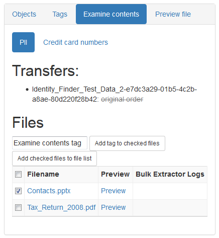

[Administration](administration.md) | **Appraisal** | [Arrangement](arrangement.md) | [Ingest](ingest.md)