## Appraisal tab

[Appraisal](http://www2.archivists.org/glossary/terms/a/appraisal), or the process of determining whether records and other materials have permanent (archival) value, is also a fundamental archival principle. The Appraisal feature in Archivematica allows archivists to:

  * review and appraise files in a particular transfer; 
  * logically arrange digital content with archival description from ArchivesSpace; and
  * ingest SIPs and deposit AIPs from Archivematica into DSpace, including metadata linked from ArchivesSpace.

### Preliminaries

Before digital processing can begin, an **Accession**, with an Identifier, must have bben created in ArchivesSpace and a **Resource** for it must exist. This will most likely have been done by the accessioning archivist.

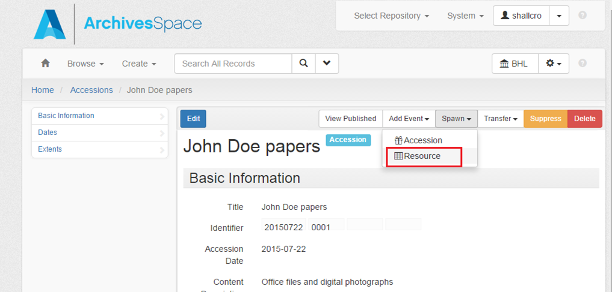

In addition, digital content must have been transferred into Archivematica and sent to the backlog using the **Transfer** pane. This will most likely have been done by the Assistant Archivist for Digital Curation.

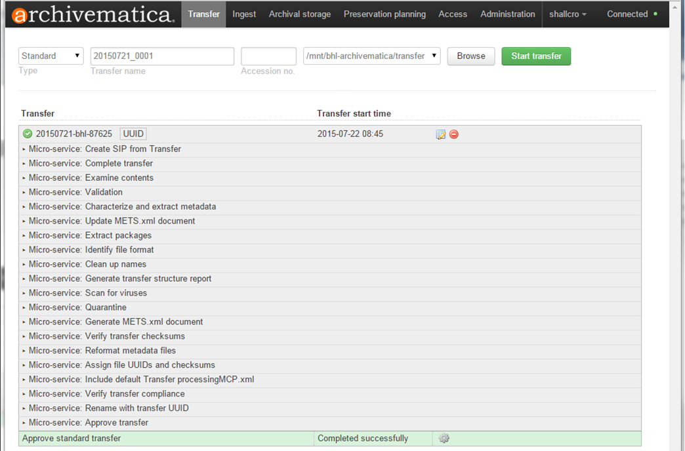

The design of the Appraisal tab is based on the idea of having different "panes" which can be toggled on and off as needed. When the Appraisal tab is loaded, the **Backlog** and **Analysis** panes display. Clicking on the other pane options (i.e., **File List** or **ArchivesSpace**) will load those panes; any pane can be removed from view by clicking again.

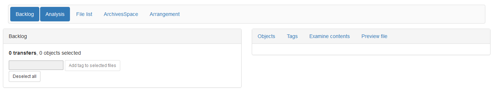

### Backlog pane and Initial Survey

Search the backlog by **Accession number** to pull up all transfers associated with a particular accession.

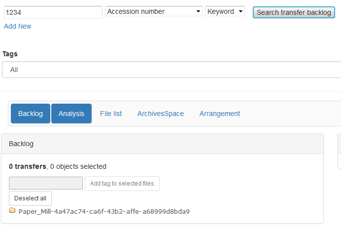

Alternatively, search the backlog using the **Path** option to search by transfer title (part of the path). *Note that Archivematica sanitizes file and folder names as part of its initial Transfer microservices--any spaces will have been replaced with underscores and this is the way they'll need to be searched.*

*Note that in the image above, Events_2006 is crossed out because all the files in that transfer have already been ingested.*

To begin an inital survey of a transfer, click on folder icons to expand the contents of that folder. To collapse the contents of a particular folder, click again on the icon. *Note that files in the transfer are located in the "objects" folder.* 

Tags may be applied in the **Backlog** pane---see [**Tagging**](appraisal.md#tagging) below.

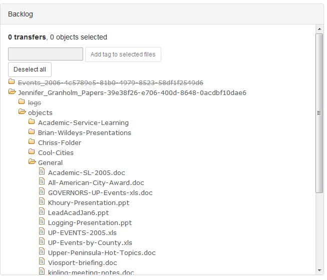

### Appraisal

Select one or more folders from the **Backlog** pane search results by clicking on the folder name to being the appraisal process. You can choose an entire transfer, a folder within a transfer or individual files. Click on the folder name again to deselect that folder, or click **Deselect all** to deselect all folders.

#### Objects

Click on **Objects** in the **Analysis** pane to see a report of file types and sizes extracted during the initial **Transfer** of material. Click **Report** to see information on file format, PRONOM PUID (clicking on this field will take you to a summary from PRONOM's technical registry), Archivematica FPR Group, number of files and size in tabular form. Columns can be sorted alphanumerically by clicking on column headers.

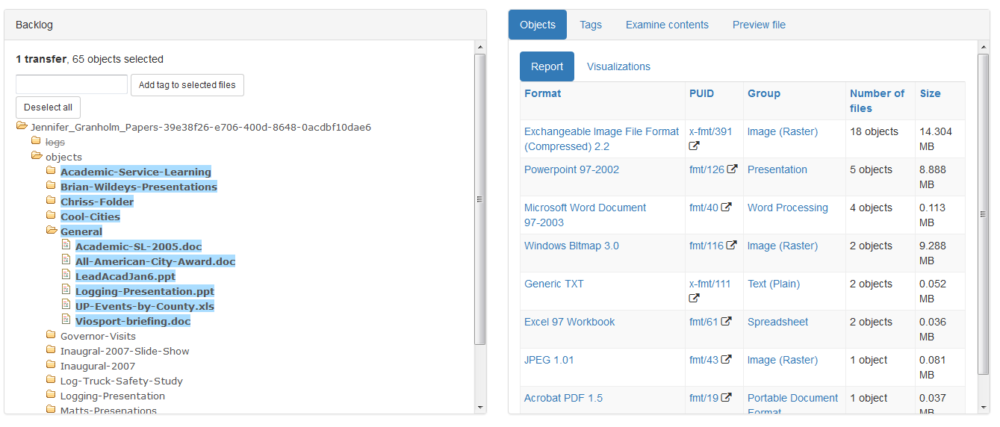

Click on **Visualizations** to see information on formats by either total number of files or total size of files in a pie chart.

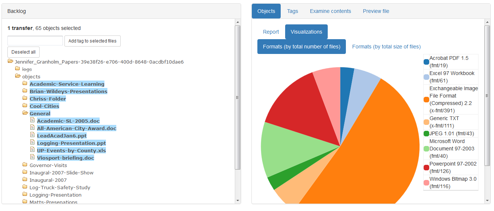

#### File list pane

Ensure that the **File List** pane is toggled on. Files in folders or selected individually in the **Backlog** pane populate the **File List**, and clicking on a format type in the **Objects** report or a wedge of the pie chart visualization in the **Analysis** pane will facet the **File List** pane with information on files of that format type, including path and filename, size, last modified date and tags. Use the **Date range start** and **Date range end** fields to limit results by date. Files may be previewed and tags may be applied from the **File List** pane---see [**Preview file**](appraisal.md#preview-file) and [**Tagging**](appraisal.md#tagging) below.

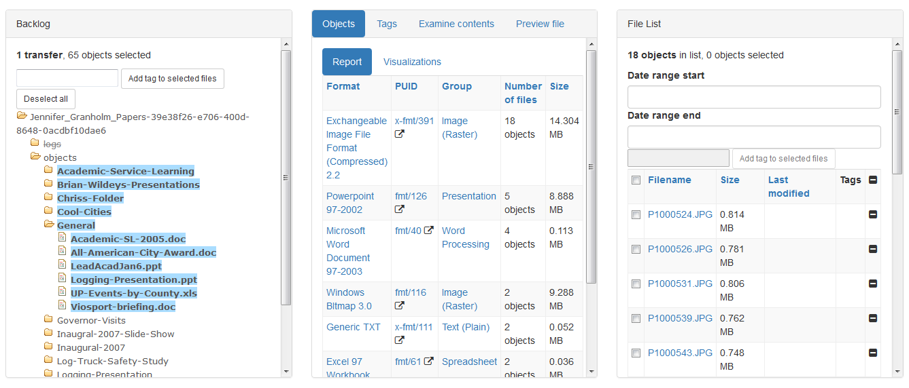

In the image above, Exchangeable Image File Format (Compressed) 2.2 was selected in the **Objects** report in the **Analysis pane**.

#### Tags

Click on **Tags** in the **Analysis** pane to see a see a report of tags that have been applied to a particular selection in a transfer and their counts. See [**Tagging**](appraisal.md#tagging) below.

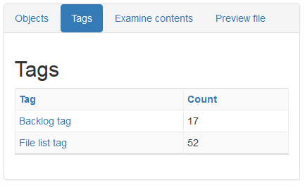

#### Examine contents

Personally identifiable information (PII) includes data such Social Security numbers (SSN) or credit card numbers that may be used to steal an individual’s identity or perpetrate fraud in some manner. To mitigate potential risks and make a best effort to protect the privacy of our donors, Archivematica employs [bulk_extractor](http://forensicswiki.org/wiki/Bulk_extractor) and its "accounts" scanner to identify PII. 

Click on **Examine Contents** in the **Analysis** pane to see bulk_extractor log content for PII. Click on a file name to see a tabular view of content and surrounding context from the bulk_extractor report. Click on **Bulk Extractor logs** to download the logs for local analysis in BEViewer, if necessary. Files may be previewed and tags may be applied from the **Examine Contents** pane---see [**Preview file**](appraisal.md#preview-file) and [**Tagging**](appraisal.md#tagging) below.

If the accession contains actual PII, consider tagging the file to note the occurrence of PII. You can use these tags to assign appropriate access restrictions to content or separate it if it is determined to be a non-essential record. 

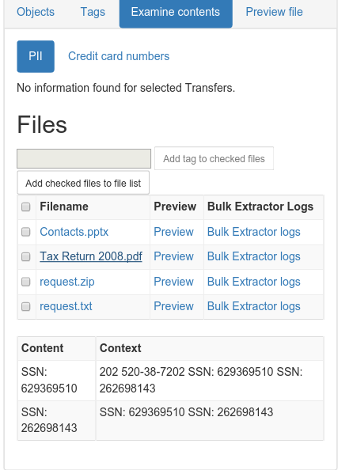

#### Preview file

To preview a file in **Preview file** in the **Analysis** pane, click on a filename from the **File List** pane or **Examine contents** in the **Analysis** pane. 
  
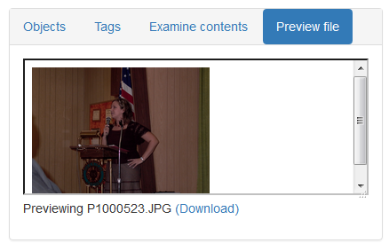

If your browser has a viewer for the format, it will appear. Click and drag the bottom right cornor of the window to expand it. Otherwise, you will be prompted to download or open the file. Alternatively, all files can be downloaded for local analysis by clicking **(Download)**. Use the following programs to manually review files:

  * Use **Quick View Plus** to review the content of most files.
  
  Quick View Plus should be used in most cases when you need to review content, as it can view more than 300 different file formats and will not change the "last accessed" time stored in the file system metadata.
  
  After opening Quick View Plus, use the mouse or arrow keys (right and left arrows may be used to expand/collapse subfolders) to navigate to the appropriate directory in the folder pane. Once the appropriate folder has been selected, a list of its contents (both subfolders and files) will be displayed in the file pane. You may use the mouse or the tab key to move to the file pane; then, whatever file is highlighted will appear in the viewing environment. Please note that very large files (especially email) may take longer to open. 
  
  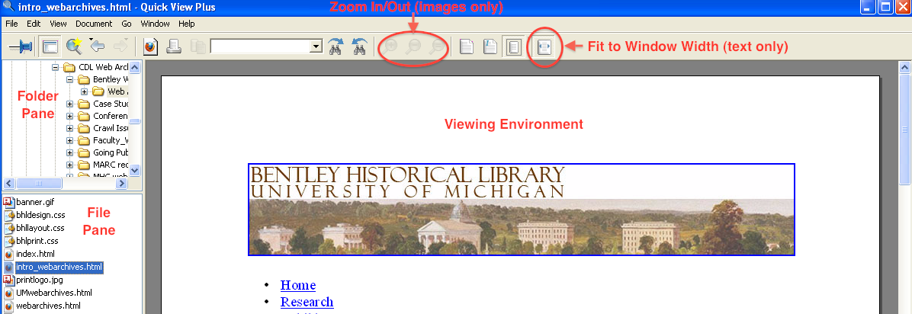
  
  While viewing a file, you may search for text in the ribbon’s text box, zoom in/out (for images only) and adjust the document size so that it fits entirely in the view are or is fit to the area’s width.
  
  *Note that in some cases, .PDF files may not render properly in Quick View Plus, with formatting issues for text and missing or incomplete images and other visual aspects. It may therefore be necessary to review these files in Adobe Reader.*
  
  * Use **IrfanView** to review the content of raster images.
    
  After opening IrfanView, you will need to click on the open file icon (or use File > Open... in the navigation menu) to access raster image files.
  
  
   
  * Use **Inkscape** to review the content of vector images.
  
  Inkscape may be used to view vector image files (such as .SVG, .AI, .WMF, etc.) that cannot be opened in IrfanView or Quick View Plus. After opening Inkscape and you will then need to click on the open file icon (or use File > Open in the navigation menu) to access vector image files.
  
  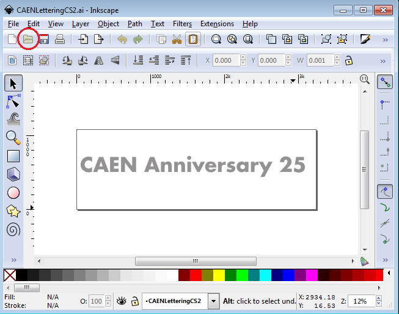
  
  * Use **VLC Media Player** to review the content of audio/video files.
  
  After opening VLC Media player, you may use the Media menu to open a single file or an entire folder (in which case, all audio/video files withing the folder will be added to a playlist).
  
  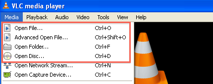
  
  Play controls are located at the bottom of the VLC Media Player window. In addition to Play, Pause and Stop buttons, the archivist may fast forward or reverse prgress by adjusting the slider on the progress bar.
  
  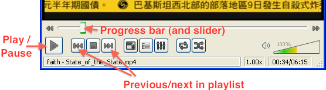
  
  If there are multiple files in a playlist, you may click the arrow keys to move to the next/previous item in a playlist.

### Tagging

Tags can be applied from the **Backlog** pane, the **File List** pane and from **Examine Contents** in the **Analysis** pane. Applying tags allows you to populated the **Backlog** pane with only tagged content of your choosing, particularly in preparation for [Arrangment to ArchivesSpace](arrangement.md). Possible use cases for tags include:

  * Tag everything that you plan to arrang in a specific series or file.
  * Tag sensitive or restricted content as you identify it through analysis.
  * Apply tags as a simple *aide memoire* while processing---it's like a virtual Post-it note.

#### From the **Backlog** pane

To apply tags in the **Backlog** pane, select the names of the folders or files you'd like to tag, enter the tag and select **Add tag to selected files**. To remove tags, click the minus sign next to the tag.

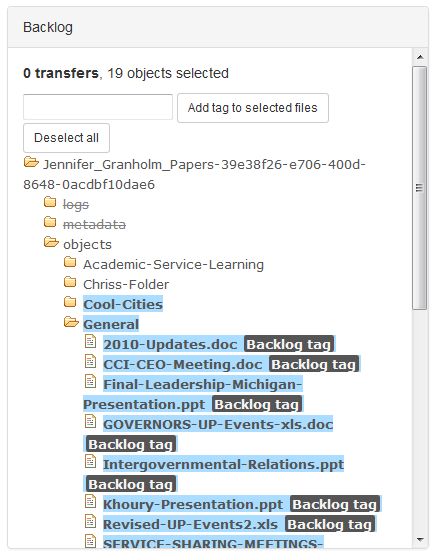

#### From the **File List** pane

To apply tags in the **File List** pane, select the checkboxes of the files you'd like to tag, enter the tag and select **Add tag to selected files**. Alternatively, select every file for tagging by clicking the checkbox next to the **Filename** column header. To remove tags, click the minus sign next to the tag.

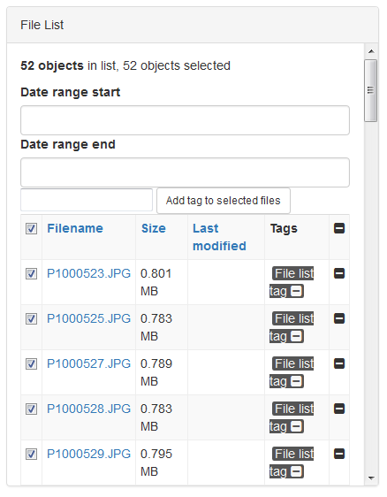

#### From **Examine Contents** in the **Analysis** pane

To apply tags in **Examine Contents** in the **Analyis** pane, select the checkboxes of the files you'd like to tag, enter the tag and select **Add tag to selected files**. Alternatively, select every file for tagging by clicking the checkbox next to the **Filename** column header. 

*Note that tags added in Examine Contents in the Analysis pane will not show up there, even though they have been applied and can be viewed or removed, for example, in the Backlog pane.*

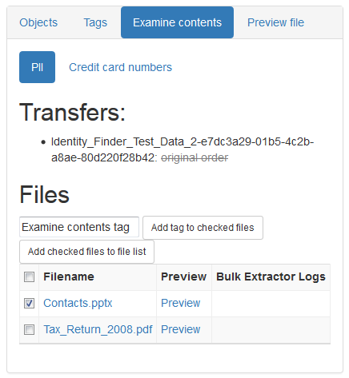

***

[Digital Processing](digital-processing.md)
  * [Administration](administration.md)
  * **Appraisal**
  * [Description and Arrangement](arrangement.md)
  * [Ingest](ingest.md)
