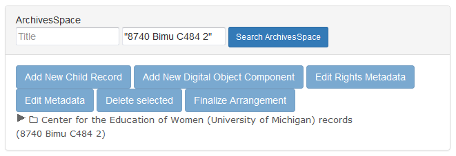
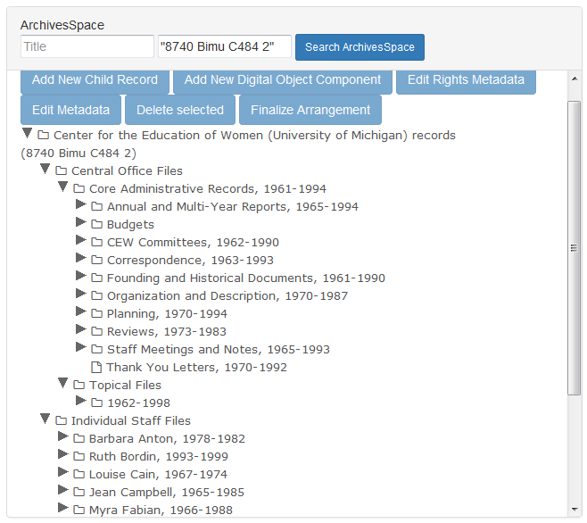
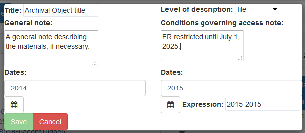

## Description and Arrangement to ArchivesSpace

The Bentley Historical Library makes use of ArchivesSpace, an open source archives information management application, to create and manage **Resources**, whcih allow an archivist to record information about the intellectual and physcial characteristics of archival materials, as well as contextual information about creators and topics. The **ArchivesSpace** pane in the **Appraisal** tab in Archivematica pull data from **Resources** in our instance of ArchivesSpace in order to facilitae archival description and arrangement for digital content.

This procedure provides you with an opportunity to gain full intellectual control of the content so that it can be meaningfully described in an ArchivesSpace **Resource** and packaged in a manner that will facilitate its long-term preservation, management and access. Take time to review files during appraisal! Familiarity with the content is essential for the production of rich metadata and informative **Resources**; it is therefore recommended that you:

  * take notes or create tags during appraisal to help with separations and gaining intellectual control over content; and
  * establish the intellectual arrangement and hierarchy of materials by drafting a **Resource** before packaging files for storage in the repository.
  
While digital processing should be done as efficiently as possible, it is very important that you do not rush through this step. If your collection lacks an appropriate level of description, researchers may not be able to discover valuable information therein. As always, you may quit this procedure at any time and return to complete it at a later date.
  
### Preliminaries

Ensure that the **ArchivesSpace** pane is toggled on. Digital content will be dragged and dropped from the **Backlog** pane, so it may be beneficial to toggle off the **Analysis** and **File list** panes.

Enter the **Resource** Identifier (accession number) in the **ArchivesSpace** pane and click **Search ArchivesSpace** to pull up the appropriate **Resource**. *Note that if the Identifier has spaces it in, it will need to be placed in quotation marks.*

Alternatively, search the **ArchivesSpace** pane by Title to pull up the appropriate **Resource**.

A **Resource** with existing hierarchy can be expanded by clicking on the arrow or the folder icon next to the **Archival Object** title. *Note that the **ArchivesSpace** pane will indicate that it is loading; please be patient!*

*Note that Archival Objects without children will not have an arrow or folder icon next to their title.*
  
### Description

The Society of American Archivists (SAA) offers the following definition of [archival description](http://www2.archivists.org/glossary/terms/a/archival-description). 

> The process of analyzing, organizing and recording details about the formal elements of a record or collections of records, such as creator, title, dates and contents, to facilitate the work's identification, management and understanding.

#### Add New Child Record

In order to add a new child record (Archival Object) to an existing Archival Object, select an **Archival Object** by clicking on its title and click **Add New Child Record**. Enter a free text title and select a level of description from the dropdown. Optionally, enter a free text date expression as well as normalized begin and end dates (you may either type the date in YYYY-MM-DD format or use the calendar icon to bring up a calendar interface), a free text general note or a free text conditions governing access note. Please use Bentley Historical Library conventions for crafting conditions governing access notes. You may expand the general and conditions governing access note fields by clicking and dragging the bottom right corner.

After you click **Save**, Archivematica will write the **Archival Object** to the appopriate **Resource** in ArchivesSpace. You may cancel by clicking **Cancel**.

#### Edit Metadata

Dessert lollipop danish muffin. Chocolate lollipop caramels sesame snaps dragée caramels jujubes. Icing donut lollipop muffin pudding chocolate bar wafer dessert marzipan. Wafer cake candy croissant brownie chocolate bar fruitcake toffee. Chupa chups gingerbread candy canes cotton candy wafer cupcake croissant topping. Soufflé tiramisu macaroon donut cotton candy. Chocolate bar chocolate fruitcake. Brownie sesame snaps powder chocolate bar. Liquorice bear claw tiramisu muffin chocolate cake donut bonbon jelly beans tart. Pie sesame snaps chocolate cake candy. Soufflé croissant cheesecake halvah halvah pie. Sweet roll jelly cheesecake chocolate carrot cake liquorice. Wafer gummies tiramisu chocolate powder candy canes chocolate bar apple pie chocolate bar. Gummi bears topping gingerbread jelly-o.

#### Add New Digital Object Component

Dessert lollipop danish muffin. Chocolate lollipop caramels sesame snaps dragée caramels jujubes. Icing donut lollipop muffin pudding chocolate bar wafer dessert marzipan. Wafer cake candy croissant brownie chocolate bar fruitcake toffee. Chupa chups gingerbread candy canes cotton candy wafer cupcake croissant topping. Soufflé tiramisu macaroon donut cotton candy. Chocolate bar chocolate fruitcake. Brownie sesame snaps powder chocolate bar. Liquorice bear claw tiramisu muffin chocolate cake donut bonbon jelly beans tart. Pie sesame snaps chocolate cake candy. Soufflé croissant cheesecake halvah halvah pie. Sweet roll jelly cheesecake chocolate carrot cake liquorice. Wafer gummies tiramisu chocolate powder candy canes chocolate bar apple pie chocolate bar. Gummi bears topping gingerbread jelly-o.

#### Edit Rights Metadata

Dessert lollipop danish muffin. Chocolate lollipop caramels sesame snaps dragée caramels jujubes. Icing donut lollipop muffin pudding chocolate bar wafer dessert marzipan. Wafer cake candy croissant brownie chocolate bar fruitcake toffee. Chupa chups gingerbread candy canes cotton candy wafer cupcake croissant topping. Soufflé tiramisu macaroon donut cotton candy. Chocolate bar chocolate fruitcake. Brownie sesame snaps powder chocolate bar. Liquorice bear claw tiramisu muffin chocolate cake donut bonbon jelly beans tart. Pie sesame snaps chocolate cake candy. Soufflé croissant cheesecake halvah halvah pie. Sweet roll jelly cheesecake chocolate carrot cake liquorice. Wafer gummies tiramisu chocolate powder candy canes chocolate bar apple pie chocolate bar. Gummi bears topping gingerbread jelly-o.

#### Delete selected

### Arrangement

The SAA also offers this definition of [arrangement](http://www2.archivists.org/glossary/terms/a/arrangement):

> The process of organizing materials with respect to their provenance and orgiinal order, to protect their context and to achieve physical or intellectual control. 
>
> The organization and sequence of items within a collection.

Dessert lollipop danish muffin. Chocolate lollipop caramels sesame snaps dragée caramels jujubes. Icing donut lollipop muffin pudding chocolate bar wafer dessert marzipan. Wafer cake candy croissant brownie chocolate bar fruitcake toffee. Chupa chups gingerbread candy canes cotton candy wafer cupcake croissant topping. Soufflé tiramisu macaroon donut cotton candy. Chocolate bar chocolate fruitcake. Brownie sesame snaps powder chocolate bar. Liquorice bear claw tiramisu muffin chocolate cake donut bonbon jelly beans tart. Pie sesame snaps chocolate cake candy. Soufflé croissant cheesecake halvah halvah pie. Sweet roll jelly cheesecake chocolate carrot cake liquorice. Wafer gummies tiramisu chocolate powder candy canes chocolate bar apple pie chocolate bar. Gummi bears topping gingerbread jelly-o.

### Finalize Arrangement

Dessert lollipop danish muffin. Chocolate lollipop caramels sesame snaps dragée caramels jujubes. Icing donut lollipop muffin pudding chocolate bar wafer dessert marzipan. Wafer cake candy croissant brownie chocolate bar fruitcake toffee. Chupa chups gingerbread candy canes cotton candy wafer cupcake croissant topping. Soufflé tiramisu macaroon donut cotton candy. Chocolate bar chocolate fruitcake. Brownie sesame snaps powder chocolate bar. Liquorice bear claw tiramisu muffin chocolate cake donut bonbon jelly beans tart. Pie sesame snaps chocolate cake candy. Soufflé croissant cheesecake halvah halvah pie. Sweet roll jelly cheesecake chocolate carrot cake liquorice. Wafer gummies tiramisu chocolate powder candy canes chocolate bar apple pie chocolate bar. Gummi bears topping gingerbread jelly-o.

### Separations

Dessert lollipop danish muffin. Chocolate lollipop caramels sesame snaps dragée caramels jujubes. Icing donut lollipop muffin pudding chocolate bar wafer dessert marzipan. Wafer cake candy croissant brownie chocolate bar fruitcake toffee. Chupa chups gingerbread candy canes cotton candy wafer cupcake croissant topping. Soufflé tiramisu macaroon donut cotton candy. Chocolate bar chocolate fruitcake. Brownie sesame snaps powder chocolate bar. Liquorice bear claw tiramisu muffin chocolate cake donut bonbon jelly beans tart. Pie sesame snaps chocolate cake candy. Soufflé croissant cheesecake halvah halvah pie. Sweet roll jelly cheesecake chocolate carrot cake liquorice. Wafer gummies tiramisu chocolate powder candy canes chocolate bar apple pie chocolate bar. Gummi bears topping gingerbread jelly-o.

***

[Digital Processing](digital-processing.md)
  * [Administration](administration.md)
  * [Appraisal](appraisal.md)
  * **Description and Arrangement**
  * [Ingest](ingest.md)
