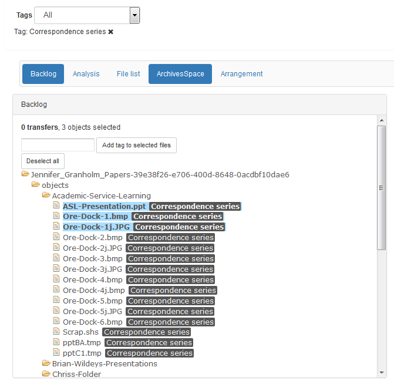

[Digital Processing](digital-processing.md)
  * [Administration](administration.md)
  * [Appraisal](appraisal.md)
  * [Description](description.md)
  * [Arrangement](arrangement.md)
  * [Ingest](ingest.md)

***

### Arrangement

The SAA also offers this definition of [arrangement](http://www2.archivists.org/glossary/terms/a/arrangement):

> The process of organizing materials with respect to their provenance and orgiinal order, to protect their context and to achieve physical or intellectual control. 
>
> The organization and sequence of items within a collection.

Digital material in the **Backlog** pane can be arranged by dragging and dropping it onto ArchivesSpace **Archival Objects** in the **ArchivesSpace** pane. It may be beneficial to toggle off the **Analysis** and **File list** panes.

#### Faceting by Tags

While not necessary to arrange digital objects, the ability fo facet the **Backlog** pane by tags is meant to facilitate arrangement. To facet by tag, select a tag from the **Tags** dropdown menu. To add additional facets (using OR logic), simply select another facet from the dropdown. Remove facets by clicking the **X** sign.

#### Arrangement to ArchivesSpace 

Before arranging files or folders from the **Backlog** pane to the **ArchivesSpace** pane, ensure that a Digital Object Component has been added. See [**Add New Digital Object Component**](appraisal.md#add-new-digital-object-component) for more information. Click and drag the file or folder onto a digital object component. *Note the only one file or folder may be dragged at a time, although more than one file or folder may be added to an individual componenet.

### Finalize Arrangement

Once all relevant files and folders have been dragged and dropped onto a Digital Object Compenent. Select the parent Archival Object by clicking on its title and then click **Finalize Arrangement** to send that SIP through the rest of the Archivematica Ingest process.

### Separations

For the time being, any material that should be separated will be left in the **Backlog** pane.
