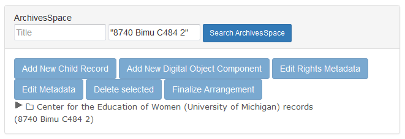
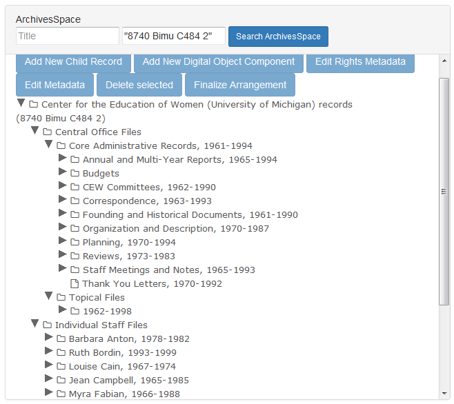
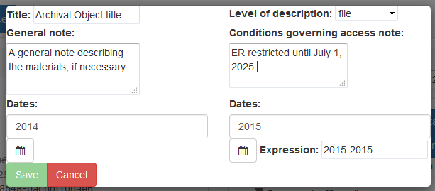
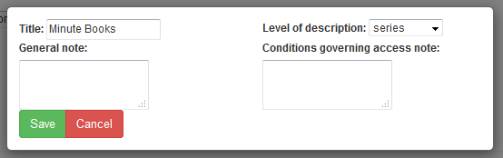
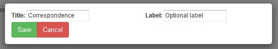
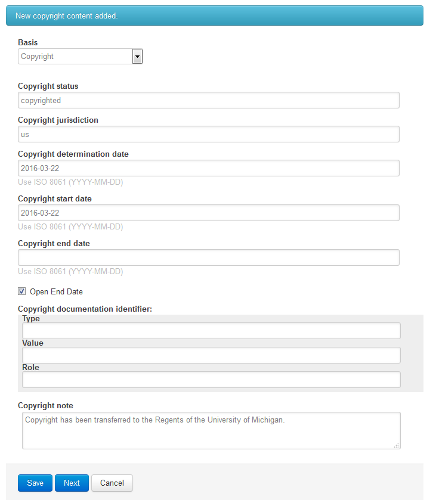

[Digital Processing](digital-processing.md)
  * [Administration](administration.md)
  * [Appraisal](appraisal.md)
  * [Description](description.md)
  * [Arrangement](arrangement.md)
  * [Ingest](ingest.md)

***

## Description

The Bentley Historical Library makes use of ArchivesSpace, an open source archives information management application, to create and manage **Resources**, which allow an archivist to record information about the intellectual and physcial characteristics of archival materials, as well as contextual information about creators and topics. The **ArchivesSpace** pane in the Appraisal tab in Archivematica pull and pushes data to and from **Resources** in our instance of ArchivesSpace in order to facilitae archival description and arrangement for digital content.

This procedure provides you with an opportunity to gain full intellectual control of the content so that it can be meaningfully described in an ArchivesSpace **Resource** and packaged in a manner that will facilitate its long-term preservation, management and access. Take time to review files during appraisal! Familiarity with the content is essential for the production of rich metadata and informative **Resources**; it is therefore recommended that you:

  * take notes or create tags during appraisal to help with separations and gaining intellectual control over content; and
  * establish the intellectual arrangement and hierarchy of materials by drafting a **Resource** before packaging files for storage in the repository.
  
While digital processing should be done as efficiently as possible, it is very important that you do not rush through this step. If your collection lacks an appropriate level of description, researchers may not be able to discover valuable information therein. As always, you may quit this procedure at any time and return to complete it at a later date.
  
### Preliminaries

Enter the **Resource** Identifier (accession number) in the **ArchivesSpace** pane and click **Search ArchivesSpace** to pull up the appropriate **Resource**. 

Alternatively, search the **ArchivesSpace** pane by Title to pull up the appropriate **Resource**.

A **Resource** with existing hierarchy can be expanded by clicking on the arrow or the folder icon next to the **Archival Object** title. *Note that the **ArchivesSpace** pane will indicate that it is loading; please be patient!* To collapse that heirarchy, click again on the arrow or folder icon.

*Note that Archival Objects without children will not have an arrow or folder icon next to their title.*
  
### Description

The Society of American Archivists (SAA) offers the following definition of [archival description](http://www2.archivists.org/glossary/terms/a/archival-description). 

> The process of analyzing, organizing and recording details about the formal elements of a record or collections of records, such as creator, title, dates and contents, to facilitate the work's identification, management and understanding.

In ArchivesSpace, this type of description is added to intellectual entities called **Archival Objects**.

#### Add New Child Record

In order to add a new child record (Archival Object) to an existing Archival Object, select an Archival Object by clicking on its title and click **Add New Child Record**. Enter a free text title and select a level of description from the dropdown. Optionally, enter a free text date expression as well as normalized begin and end dates (you may either type the date in YYYY-MM-DD format or use the calendar icon to bring up a calendar interface), a free text general note or a free text conditions governing access note. Please use Bentley Historical Library conventions for crafting conditions governing access notes. You may expand the general and conditions governing access note fields by clicking and dragging the bottom right corner.

After you click **Save**, Archivematica will write the Archival Object to the appopriate Resource in ArchivesSpace. You may cancel by clicking **Cancel**.

#### Edit Metadata

In order to edit an existing existing Archival Object, select an Archival Object by clicking on its title and click **Edit Metadata**. Edit the free text title and edit the level of description form the dropdown. Optionally, edit the free text general note or free text condititons governing access note.

After you click **Save**, Archivematica will write the Archival Object to the appopriate Resource in ArchivesSpace. You may cancel by clicking **Cancel**.

#### Add New Digital Object Component

In order to associate digital objects with intellectual entities, object entities called **Digital Objects** and their component **Digital Object Components** must be added to **Archival Objects** (to which digitial objects will eventually be dragged). To add a new digital object component to an existing Archival Object, select an Archival Object by clicking on its title and click **Add New Digital Object Component**. Enter a free text title. Optionally, add free text label.

Click **Save**. You may cancel by clicking **Cancel**.

#### Edit Rights Metadata

In order to apply rights metadata with intellectual entities, [PREMIS Rights Statements](http://www.loc.gov/standards/premis/Rights-in-the-PREMIS-Data-Model.pdf) must be added to **Archival Objects**. To add new rights metadata to an existing Archival Object, select an Archival Object by clicking on its title and click **Add Rights Metadata**. In the new tab, click **Add** to add a PREMIS rights statement.

##### Copyright

Copyright should always be added. Fill out the template like so:

Field | Definition | Suggested Values | Description (if needed)
--- | --- | --- | ---
**Basis** | Designation of the basis for the right or permission descriped in the rights statement. | Copyright | 
**Copyright status** | Copyright status of the object at the time the rights statement is recorded. | copyrighted OR publicdomain OR unknown | Choose one.
**Copyright jurisdiction** | The country whose copyright laws apply. | us | Taken from ISO 3166.
**Copyright determination date** | The date that the copyright status recorded in **Copyright status** was determined. | YYYY-MM-DD | This is optional. Use the date of the accession or, alternatively, use today's date.
**Copyright start date** | The date the granted copyright commences. | YYYY-MM-DD | Use today's date.
**Copyright end date** | The date the granted copyright expires. | YYYY-MM-DD | Leave blank.
**Open end date** | | The end date at which the particular copyright applies or is applied to the content. | Checked | 
**Copyright note** | Additional information about the copyright status of the object. | "Copyright has been transferred to the Regents of the University of Michigan." OR "Copyright has not been transferred to the Regents of the University of Michigan." | Choose one.

Click **Next**. There is no need to add an act to a copyright basis. Click **Done**.

##### Access

Access rights should be added only when access is restricted based on Bentley policy or the donor agreement. Forthcoming...

#### Delete selected

To delete and Archival object, select an Archival Object by clicking its title and click **Delete selected**. At the prompt, select **Yes** to delete or **Cancel** to cancel. Be sure that you want to delete it!

