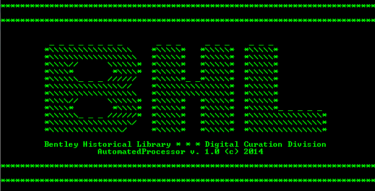
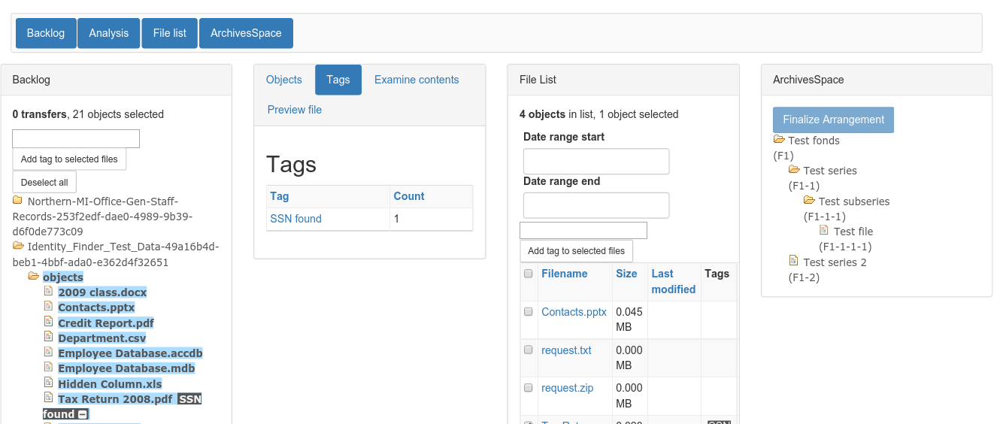

Digital Processing
==================

The Bentley Historical Library's digital processing procedures reflect not only our general policies and the traditional archival functions of appraisal, arrangement and description, but also encompass additional procedures that ensure the authenticity, integrity and security of digital content.

Digital Processing Defined
--------------------------

In this context, "digital processing" corresponds to the Generate AIP function of the [Reference Model for an Open Archival Information System (OAIS)](http://public.ccsds.org/publications/archive/650x0m2.pdf)’s Ingest entity. 

After associating digital content with an accession record and transfering it into Archivematica, digital processing permits archivists to establish the integrity of materials, assume intellectual control over them and perform preservation events on them (e.g., scans for viruses and personally identifiable information, conversion to preservation formats, recording of descriptive and technical metadata, etc.). This creates one or more Submission Information Packages (SIPs) and transforms them into Archival Information Packages (AIPs) which are then deposited into [Deep Blue](http://deepblue.lib.umich.edu/), a DSpace repository where portions of AIPs usually double as a Dissemination Information Package (DIP). In some cases---namely for very large audio, video or image files---an additional DIP will be created to make it easier for patrons to download and access materials.

Evolution of Digital Processing Procedures
------------------------------------------

The Bentley's current digital processing procedures have evolved from both a largely [manual workflow](http://deepblue.lib.umich.edu/handle/2027.42/96439) and also one that made use of [AutomatedProcessor (AutoPro)](http://deepblue.lib.umich.edu/handle/2027.42/97298), a tool developed in-house that made digital processing more efficient reduced technical barriers, thereby permitting archivists to focus their energies on the traditional archival functions of appraisal, arrangement, and description.

Current Digital Processing Procedures
-------------------------------------

The latest iteration of our workflow involves the use of [Archivematica](https://www.archivematica.org/en/), a web- and standards-based, open-source application that allows institutions to preserve long-term access to trustworthy, authentic and reliable digital content, and includes the use of a new Appraisal and Arrangement feature, an outcome of the Mellon Foundation-funded ArchivesSpace-Archivematica-DSpace Workflow Integration project. 

This feature allows archivists to:

  1. review and appraise files; 
  2. logically arrange digital content with archival description from ArchivesSpace; and
  3. deposit AIPs from Archivematica into DSpace, including metadata linked from ArchivesSpace.

This section of the manual will provide an overview of the digital processing workflow and more detailed guidelines for individual steps.

[Administration](administration.md) | [Transfer](transfer.md) | [Appraisal](appraisal.md) | [Ingest](ingest.md)
