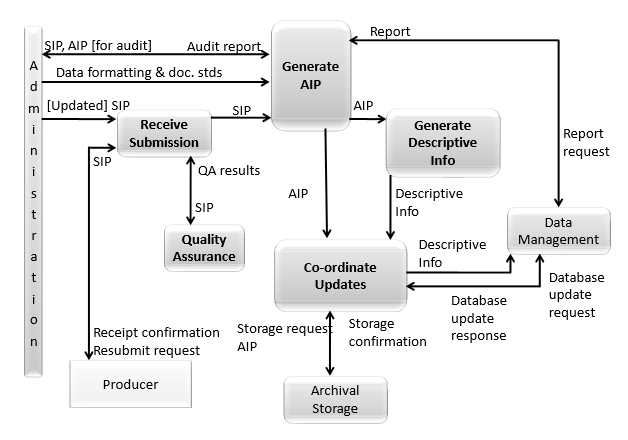
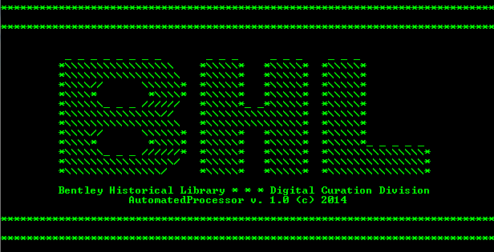
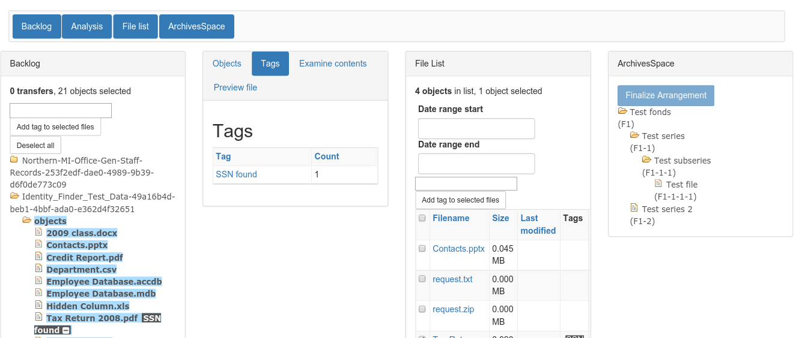

[Digital Processing](digital-processing.md)
  * [Administration](administration.md)
  * [Appraisal](appraisal.md)
  * [Description](description.md)
  * [Arrangement](arrangement.md)
  * [Ingest](ingest.md)

***

## Digital Processing

The Bentley Historical Library's digital processing procedures reflect not only our institutional policies and the traditional archival functions of appraisal, arrangement and description, but also encompass additional procedures that ensure the authenticity, integrity and security of digital content.

### Digital Processing Defined

In this context, "digital processing" corresponds to the Generate AIP function of the [Reference Model for an Open Archival Information System (OAIS)](http://public.ccsds.org/publications/archive/650x0m2.pdf)’s Ingest entity. 

After the Assistant Archivist for Digital Curation associates digital content with an accession record and transfers it into Archivematica's Backlog, digital processing permits archivists to establish the integrity of materials, assume intellectual control over them and perform preservation events on them (e.g., scans for viruses and personally identifiable information, conversion to preservation formats, recording of descriptive and technical metadata, etc.). This creates one or more Submission Information Packages (SIPs) and transforms them into Archival Information Packages (AIPs) which are then deposited into [Deep Blue](http://deepblue.lib.umich.edu/), a DSpace repository where repackaged AIPs usually double as Dissemination Information Packages (DIPs). In some cases---e.g., very large audio, video or image files---an additional DIP will be created to make it easier for patrons to download and access materials.

### Evolution of Digital Processing Procedures

The Bentley's current digital processing procedures have evolved from a highly [manual workflow](http://deepblue.lib.umich.edu/handle/2027.42/96439) that invovled more than 40 discrete steps, the operation of numerous stand-alone applications and saving tool output in various log files. [AutomatedProcessor (AutoPro)](http://deepblue.lib.umich.edu/handle/2027.42/97298), an in-house tool developed by Bentley staff, made digital processing more efficient and reduced technical barriers, thereby permitting archivists to focus their energies on the traditional archival functions of appraisal, arrangement, and description.

For various reasons, however, this too was not a long-term solution. We now employ [Archivematica](https://www.archivematica.org/en/), a web- and standards-based, open-source application that allows institutions to preserve long-term access to trustworthy, authentic and reliable digital content, in our digital processing workflow, as wella as the Appraisal and Arrangement feature, an outcome our Mellon Foundation-funded [ArchivesSpace-Archivematica-DSpace Workflow Integration](http://archival-integration.blogspot.com/) project which concluded in October 2016. 

This feature allows archivists to:

  * review and appraise files in a particular transfer; 
  * logically arrange digital content with archival description from ArchivesSpace; and
  * ingest SIPs and deposit AIPs from Archivematica into DSpace, including metadata linked from ArchivesSpace.

This section of the manual will provide an overview of the digital processing workflow and more detailed guidelines for individual steps.

